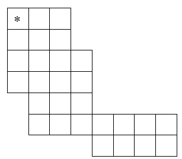

A knight is a piece used in the game of chess. The chessboard itself is square array of cells. Each time a knight moves, its resulting position is two rows and one column, or two columns and one row away from its starting position. Thus a knight starting on row r, column c – which we’ll denote as (r, c) – can move to any of the squares (r-2,c-1), (r-2,c+1), (r-1,c-2), (r-1,c+2), (r+1,c-2), (r+1,c+2), (r+2,c-1), or (r+2,c+1). Of course, the knight may not move to any square that is not on the board.

Suppose the chessboard is not square, but instead has rows with variable numbers of columns, and with each row offset zero or more columns to the right of the row above it. The figure to the left illustrates one possible configuration. How many of the squares in such a modified chessboard can a knight, starting in the upper left square (marked with an asterisk), not reach in any number of moves without resting in any square more than once?

If necessary, the knight is permitted to pass over regions that are outside the borders of the modified chessboard, but as usual, it can only move to squares that are within the borders of the board.

Input
There will be multiple cases to consider. The input for each case begins with an integer n, between 1 and 10, that specifies the number of rows in the modified chessboard. Following n there will be n pairs of integers, with the ith pair corresponding to the ith row of the chessboard. The first integer of each pair indicates the number of squares skipped at the beginning of the row. The second integer indicates the number of squares in the row (which will always be at least 1).The last case will be followed by the integer 0.

For example, input for the case illustrated by the chessboard shown above would be:

7 0 3 0 3 0 4 0 4 1 3 1 7 4 4

The maximum dimensions of the board will be 10 rows and 10 columns. That is, any modified chessboard specified by the input will fit completely on a 10 row, 10 column board.

Output
For each input case, display the case number (1, 2, …), and the number of squares that the knight can not reach. Display the results in the format shown in the examples below.

Example

Input:

7 0 3 0 3 0 4 0 4 1 3 1 7 4 4

3 0 3 0 3 0 3

2 0 1 2 1

0

Output:

Case 1, 4 squares can not be reached.

Case 2, 1 square can not be reached.

Case 3, 0 squares can not be reached.